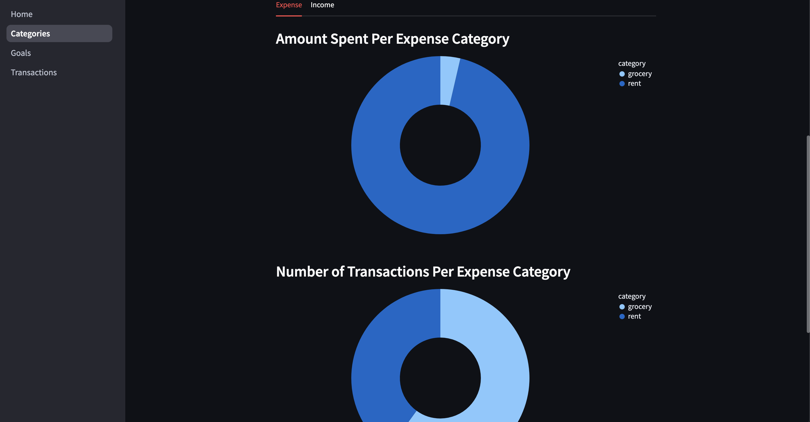
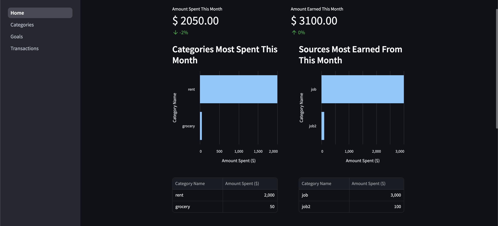
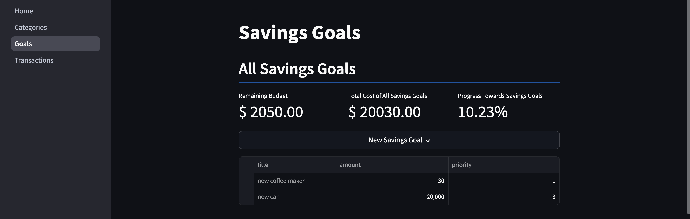

# About The Project

This project sets up a very simple single-user budgeting application. Users are able to track income, expenses, and savings goals. This project uses the Streamlit framework for the user interface and an SQLite database to persist the data.

# Setup and Installation

The easiest way to run this project is by pulling the Docker image and creating a container from it.

With Docker installed, pull the image by running the command:
```
docker pull descrazy03/budget-app
```
Next, run the image to create a container:
```
docker run -p 8501:8501 descrazy03/budget-app
```
Finally, navigate to http://localhost:8501/ with the container running.

# Screenshots

Expense Tracking


Monthly Tracking


Savings goal tracking